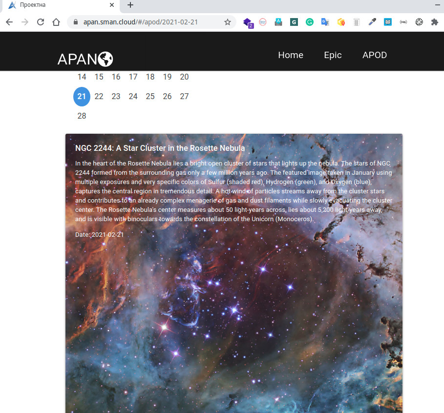

# [NASA open API](https://api.nasa.gov/)

The objective of this open API is to make NASA data, including imagery, eminently accessible to application developers.
We use just a couple, for now, NASA open APIs: APOD and EPIC.

## APOD: Astronomy Picture of the Day

  One of the most popular websites at NASA is the Astronomy Picture of the Day. This website is one of the most popular websites across all federal agencies. This endpoint structures the APOD imagery and associated metadata so that it can be repurposed for other applications. Also, if the concept_tags parameter is set to True, then keywords derived from the image explanation are returned. These keywords could be used as auto-generated hashtags for Twitter or Instagram feeds, but generally help with the discoverability of relevant imagery.

  The full documentation for this API can be found in the [APOD API Github repository](https://github.com/nasa/apod-api).

### HTTP Request

```sh
GET https://api.nasa.gov/planetary/apod
```

In our code with useEffect hook:

```jsx
useEffect(() => {
    if(datePar===undefined)
        history.push( "/apod/"+moment().format('YYYY-MM-DD') );
    else        
        axios.get(`https://api.nasa.gov/planetary/apod?date=`+datePar+`&api_key=zLcj2YQqAcjw4XMvcJPgZUtlbReqV1MonlwC8iqG`)
        .then((res) => {
            setApodData(res.data);
        });
  }, [datePar,history]);
```

In this piece of code, we fetch raw meta data from the service and transform (render) on the page.


